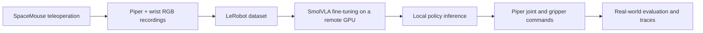

# Piper × SmolVLA

A hands-on robot learning project: collect demonstrations with a SpaceMouse, fine-tune SmolVLA, and run the learned policy on an AgileX Piper arm with a wrist camera.

The first experiment is language-conditioned cube pick-and-place:

> “put the red cube in the black box”
>
> “put the white cube in the black box”

**Current result:** the operator has completed real-arm grasping and red-cube task trials. White-cube instructions are not yet reliable: the arm can select the red cube instead. Motion jitter is also an active investigation. These are preliminary demonstrations; there is no measured success-rate benchmark yet.

[Training & inference guide](SMOLVLA.md) · [中文操作速查](操作速查.md) · [Results & next experiments](docs/PROJECT_NOTES.md)

## What is in this project?

- SpaceMouse Cartesian teleoperation, inverse kinematics and joint-position control.
- Synchronized wrist RGB, measured robot state and commanded-action recording.
- Episode inspection and conversion to a LeRobot dataset.
- SmolVLA inference with checkpoint preprocessing/postprocessing, a separate policy worker, action smoothing and trace logging.
- Optional ROS 2 / MoveIt integration, robot description and earlier gravity-compensation experiments.



## Hardware and data

| Component | This experiment |
| --- | --- |
| Arm | AgileX Piper, six joints, USB-CAN / SocketCAN |
| End effector | Pika gripper, wrist-mounted RealSense D405 |
| Demonstration input | 3Dconnexion SpaceMouse |
| Observation | Wrist RGB at 640 × 480, 30 FPS; six measured joint angles + gripper width |
| Action | Six commanded joint positions in radians + gripper width in metres |
| Collected episodes | 55 retained demonstrations: 28 red, 27 white; practice episode `000` excluded |
| Training run | SmolVLA base, 20,000 steps, batch size 64, one rented RTX 4090 |
| Local inference | Linux laptop, RTX 5070 Ti Laptop GPU, separate LeRobot environment |

The data count describes the local collection. The exact exported server dataset and a formal evaluation split are not included in this repository. Raw recordings, trained weights, caches and local audit reports are kept outside Git.

## Getting started

```bash
git clone https://github.com/zhaoyufei122/piper-smolvla.git
cd piper-smolvla
```

For real-arm use, this is a **Linux** project. Windows can be used to edit the source and documentation; native Windows robot operation is not covered. ROS 2 is optional for the SDK-based collection and policy workflow.

Use the existing working environment if you already have one. The reference inference environment is Python 3.12, LeRobot 0.6.1, PyTorch 2.11.0+cu128 and torchvision 0.26.0+cu128. See [setup and dependency notes](SMOLVLA.md#environment) before installing dependencies; installing LeRobot into a different environment may also download or replace PyTorch.

The basic workflow is:

1. Bring up CAN and verify feedback with `sdk_tests/arm_tool.py status`.
2. Use `sdk_tests/teleop_spacemouse.py` to collect labelled demonstrations.
3. Inspect episodes and convert a selected subset using `sdk_tests/to_lerobot.py`.
4. Fine-tune with `lerobot-train` and copy the full `pretrained_model` directory back locally.
5. Run `sdk_tests/run_policy.py` with the same task wording and matching camera configuration.

Exact commands are in [SMOLVLA.md](SMOLVLA.md). Hardware bring-up and the older ROS / MoveIt workflow are in [docs/BRINGUP.md](docs/BRINGUP.md) and [TESTING.md](TESTING.md).

### Example inference command

With the checkpoint already downloaded and the hardware prepared:

```bash
conda activate lerobot
export PYTHONNOUSERSITE=1
cd sdk_tests
python run_policy.py "$HOME/piper_data/policies/piper_cubes_020000/pretrained_model" \
  --task "put the red cube in the black box" \
  --camera-serial YOUR_D405_SERIAL \
  --trace "$HOME/piper_data/runs" \
  --dry-run
```

`--dry-run` suppresses motion commands but still opens CAN and the real camera; SDK initialization can send query frames. It is not an offline simulator. The terminal must have focus for the space / `q` keys. Removing `--dry-run` enables real robot operation.

**Experimental controller:** the software stop and fault paths still need work, particularly during automatic return-home. Do not treat the keyboard pause as a verified emergency stop. Review the [known control issues](docs/PROJECT_NOTES.md#control-code-status) before hardware use. Camera serials, tool geometry, workspace limits and return poses must match the actual setup.

## Repository map

```text
sdk_tests/
  teleop_spacemouse.py    SpaceMouse control and demonstration collection
  recorder.py            Wrist camera and episode writer
  check_episode.py       Inspect a recorded episode
  to_lerobot.py          Dataset conversion
  run_policy.py          Local SmolVLA policy execution
  analyse_shake.py       Inspect inference trace signals
  analyse_trace.py       Inspect teleoperation traces
  piper_common.py        SDK helpers and unit conversion
  gravity_model.py       Robot geometry, gravity model and IK
  arm_tool.py            Status and low-level arm utilities
  joint_position_ctrl.py Direct joint-position moves
scripts/                 CAN and SpaceMouse setup helpers
ros2_ws/src/             Robot description, ROS bridge and MoveIt configuration
docs/                    Project notes and earlier design / bring-up notes
SMOLVLA.md               Collection, conversion, training and inference commands
操作速查.md               Chinese bench reference
```

## Next steps

- Evaluate target-colour selection with matched red/white instructions and swapped object positions.
- Trace and reduce motion jitter while preserving task completion.
- Validate stop, restart, stale-feedback and automatic return-home behavior.
- Record repeatable trials, failure types and a demonstration video for the project page.

## Credits

This project uses [Hugging Face LeRobot](https://github.com/huggingface/lerobot), [SmolVLA](https://huggingface.co/lerobot/smolvla_base), the [Piper SDK](https://github.com/agilexrobotics/piper_sdk), and robot-description assets from [piper_ros](https://github.com/agilexrobotics/piper_ros). See [third-party notices](THIRD_PARTY_NOTICES.md) for the retained upstream license and provenance.
